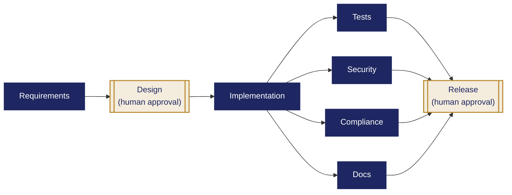

# Agentic URL Shortener

A production-minded URL-shortener prototype demonstrating controlled
AI-agent execution across the software-development lifecycle.

## Features

- Create short URLs
- Validate HTTP and HTTPS URLs
- Redirect using HTTP 307
- Lifetime click analytics
- Daily click counts grouped by UTC date
- SQLite transaction safety
- Explicit dependency graph
- Human design and release approvals
- Bounded retries and safe-stop behavior
- Candidate isolation and validation
- Security-review gate
- Compliance-review gate (data-privacy and scope checks)
- Documentation generation
- Audit events and reliability metrics
- Greenfield, brownfield, and ambiguous scenarios

## Why This Is Agentic

- **Interprets intent** — distinguishes what was actually requested from existing system context, and asks for clarification instead of guessing at ambiguous requirements
- **Decomposes work** — converts a requirement into an explicit, dependency-aware task graph, not a single prompt
- **Executes with bounded autonomy** — agents generate designs and code candidates, but never apply anything unvalidated or unreviewed
- **Recovers safely** — bounded retries, a model fallback, and an executable rollback handle failure without human intervention for every case
- **Defers to humans at high-impact points** — design and release cannot proceed without an explicit human decision and recorded rationale

## Architecture

The application uses FastAPI and SQLite.

The orchestration lifecycle is:

    requirements
        -> design [human approval]
            -> implementation
                -> tests
                -> security
                -> compliance
                -> documentation
                    -> release [human approval]

Tests, security, compliance, and documentation can run independently
after implementation. Release requires all four and explicit human
approval.



Navy nodes are automated/deterministic stages; gold nodes are human
approval checkpoints. Tests, Security, Compliance, and Docs have no
dependency on each other and only converge at Release.

See `docs/architecture/overview.md` for details.

## Low-Level Design

### API Contract

| Method | Path | Request | Response | Status Codes |
|---|---|---|---|---|
| GET | `/` | -- | `HealthResponse { message: str }` | 200 |
| POST | `/shorten` | `ShortenRequest { original_url: str }` | `ShortenResponse { short_code: str, short_url: str }` | 200, 400 (invalid URL) |
| GET | `/{short_code}` | -- | HTTP redirect (no body) | 307 (redirect), 404 (unknown code), 503 (DB busy) |
| GET | `/analytics/{short_code}` | -- | `AnalyticsResponse { short_code: str, original_url: str, clicks: int, created_at: str, daily_counts: list[DailyCount] }`, where `DailyCount = { date: str, count: int }` | 200, 404 (unknown code) |

All request/response shapes are real Pydantic models declared in
`app/main.py` (`ShortenRequest`, `ShortenResponse`, `AnalyticsResponse`,
`DailyCount`, `HealthResponse`) and enforced via FastAPI's
`response_model` on every JSON-returning route, so this table cannot
drift from the actual code without FastAPI's own validation catching it.

### Database Schema

**`urls`**

| Column | Type | Constraints |
|---|---|---|
| `short_code` | TEXT | PRIMARY KEY |
| `original_url` | TEXT | NOT NULL |
| `clicks` | INTEGER | NOT NULL, DEFAULT 0 |
| `created_at` | TEXT | NOT NULL (ISO-8601 UTC) |

**`daily_clicks`**

| Column | Type | Constraints |
|---|---|---|
| `short_code` | TEXT | NOT NULL, FOREIGN KEY -> `urls(short_code)` |
| `click_date` | TEXT | NOT NULL (UTC, `YYYY-MM-DD`) |
| `count` | INTEGER | NOT NULL, DEFAULT 1 |
| | | PRIMARY KEY (`short_code`, `click_date`) |

`clicks` on `urls` and the matching row in `daily_clicks` are updated
in the same transaction on every redirect, so the two can never drift
out of sync from a partial write.

### Orchestrator Module Map

| Module | Responsibility |
|---|---|
| `state.py` | `WorkflowState`, `Task`, `Decision` dataclasses; `record_decision()` |
| `storage.py` | JSON persistence; auto-logs every task status change as an event |
| `planner.py` | Builds the 8-node dependency graph |
| `scheduler.py` | `ready_tasks()` -- computes what can run right now |
| `start_workflow.py` | CLI: creates a new workflow from `requirements/*.txt` |
| `gemini_client.py` | Shared Gemini call wrapper with automatic fallback-model support |
| `requirements_agent.py` / `review_requirements.py` | Normalizes the requirement; blocks for human review |
| `approve_requirements.py` | Records the human requirements decision |
| `update_requirement.py` | Re-plans when the requirement changes; invalidates downstream state |
| `design_agent.py` / `correct_design.py` | Proposes architecture; lets a human inject a correction |
| `approvals.py` | Interactive human approval gates (design and release) |
| `implementation_agent.py` | Generates an isolated candidate module (never edits the live app) |
| `validate_candidate.py` | Runs the real test suite against the candidate in a sandbox |
| `apply_candidate.py` | Hash-verifies, backs up, and applies the validated candidate |
| `rollback_candidate.py` | Restores the pre-apply backup on human confirmation |
| `executor.py` / `test_runner.py` | Runs the API test suite; one bounded retry |
| `security_agent.py` | Deterministic security scan (secrets, `eval`/`exec`, required controls) |
| `compliance_agent.py` | Deterministic compliance scan (PII, scope violations) |
| `documentation_agent.py` | Generates architecture/scenario/summary docs |
| `release_agent.py` / `review_release.py` | Confirms all gates passed; writes the release-readiness report |
| `metrics.py` | Success rate, retries, rollbacks, MTTR, end-to-end latency |
| `run_pipeline.py` | Single entry point -- drives the graph, pausing only at human gates |
| `audit_demo.py` | Deterministic retry/rollback/metrics demo, no API key required |
| `check_config.py` / `check_gemini.py` / `demo_approval.py` | Manual sanity-check scripts, not part of the pipeline |

## Project Structure

    app/                 FastAPI application and tests
    orchestrator/        Workflow agents, gates, storage, and metrics
    docs/architecture/   Architecture documentation
    docs/scenarios/      Greenfield, brownfield, and ambiguous scenarios
    requirements/        Normalized engineering requirements
    reports/             Engineering and release-readiness reports
    runs/                Local runtime evidence; ignored by Git

## Setup

### 1. Create the environment

    python3 -m venv .venv
    source .venv/bin/activate

### 2. Install dependencies

    python -m pip install --upgrade pip
    python -m pip install -r requirements.txt

### 3. Configure Gemini

Copy `.env.example` to `.env` and add a private Gemini API key.

Never commit `.env`.

### 4. Start the API

    python -m uvicorn app.main:app --reload

Open:

    http://127.0.0.1:8000/docs

## API Examples

### Create a short URL

    curl -X POST http://127.0.0.1:8000/shorten \
      -H "Content-Type: application/json" \
      -d '{"original_url":"https://www.example.com"}'

### Redirect

    http://127.0.0.1:8000/{short_code}

### Analytics

    http://127.0.0.1:8000/analytics/{short_code}

Example response:

```json
{
  "short_code": "example",
  "original_url": "https://www.example.com",
  "clicks": 5,
  "created_at": "2026-09-05T05:47:20+00:00",
  "daily_counts": [
    {
      "date": "2026-09-06",
      "count": 1
    }
  ]
}
```

## Running the Full Pipeline

Each stage can still be run individually (see the scripts in
`orchestrator/`), but `run_pipeline.py` drives the whole workflow
forward automatically wherever no human decision is required, and
pauses cleanly at requirements review, design approval, and release
approval:

    python -m orchestrator.run_pipeline runs/<run-id>/workflow.json

Run it again after each approval to continue from where it stopped.
It never auto-approves anything; it only removes the need to
remember which script to run next.

## Testing

Run:

    python -m pytest app/tests -q

Current verified result:

    67 passed

Two dependency deprecation warnings remain and are documented as a
known limitation.

## Demonstrated Scenarios

- Greenfield URL-shortener construction
- Brownfield daily-analytics enhancement
- Ambiguous analytics request with safe clarification stop
- Controlled audit, retry, and recovery demonstration
- Test-improvement: closing a release-gate coverage gap

See `docs/scenarios/`.

## Reliability Evidence

The audit demonstration recorded:

- 8 completed tasks
- 10 total attempts
- 2 bounded retries (one test retry, one post-rollback re-implementation)
- 1 rollback
- ~0.03-second MTTR
- ~0.4-second end-to-end latency
- 32 audit events

These values come from a labelled local demonstration, not production
traffic.

## Security Controls

- HTTP/HTTPS validation
- Parameterized SQL
- SQLite foreign-key enforcement
- Atomic analytics increments
- Bounded database lock wait
- Controlled 503 response
- Tracked-secret checks
- Dangerous Python-call checks
- Human design and release approvals

## Compliance Controls

- PII and tracking-term scan of application source
- PII-shaped database column scan
- Requirement out-of-scope violation detection
- Release blocked until compliance passes

## Limitations

- SQLite permits limited write concurrency.
- Authentication and user ownership are not implemented.
- Rate limiting is not implemented.
- The prototype is not publicly deployed.
- Gemini availability depends on hosted API limits.
- Test dependency deprecation warnings remain.

## Governance Principle

Agents execute within defined autonomy boundaries. Humans own
requirements approval, design correction, release approval, and final
quality decisions.

## Important Security Note

Never commit `.env`, API keys, database files, private keys, or runtime
artifacts.
